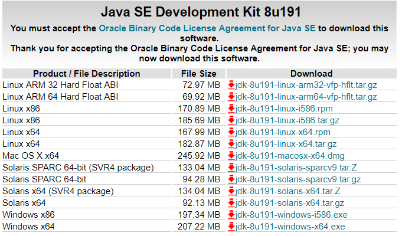
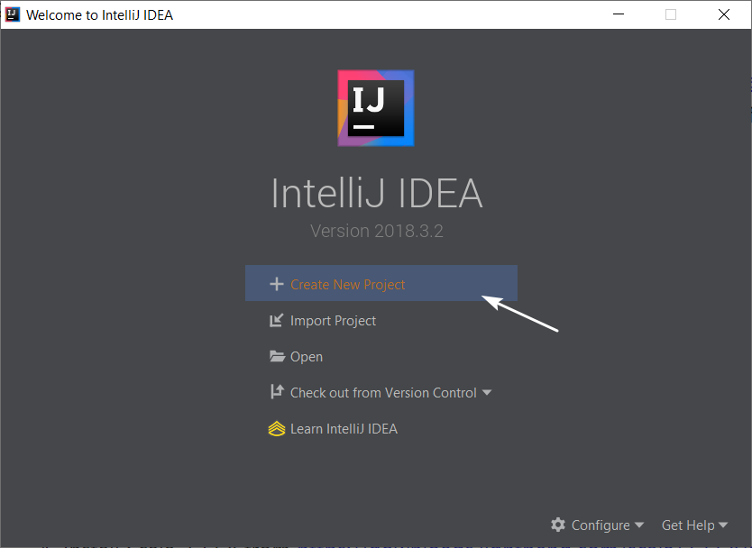
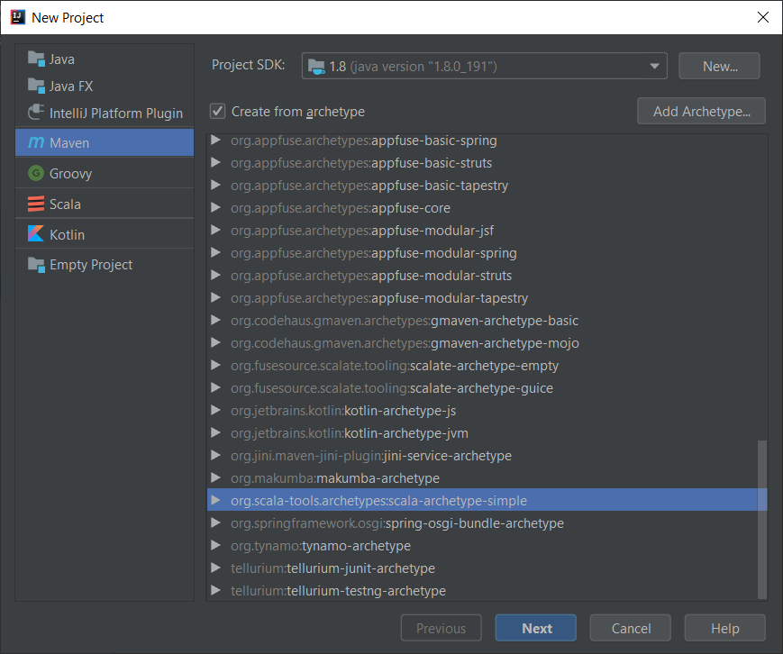
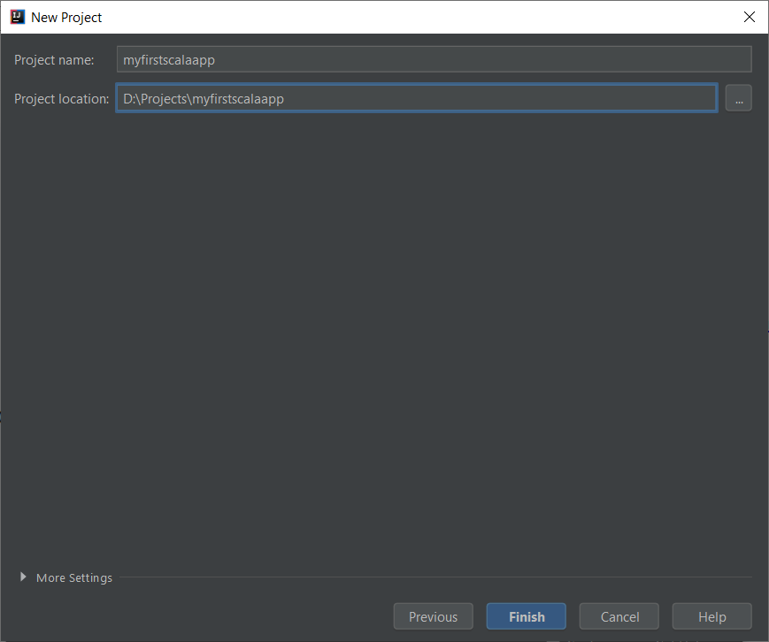
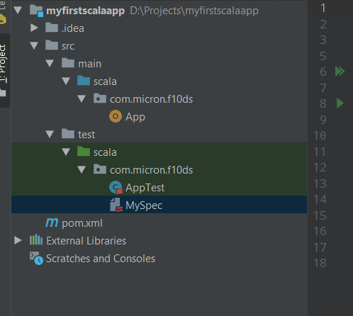
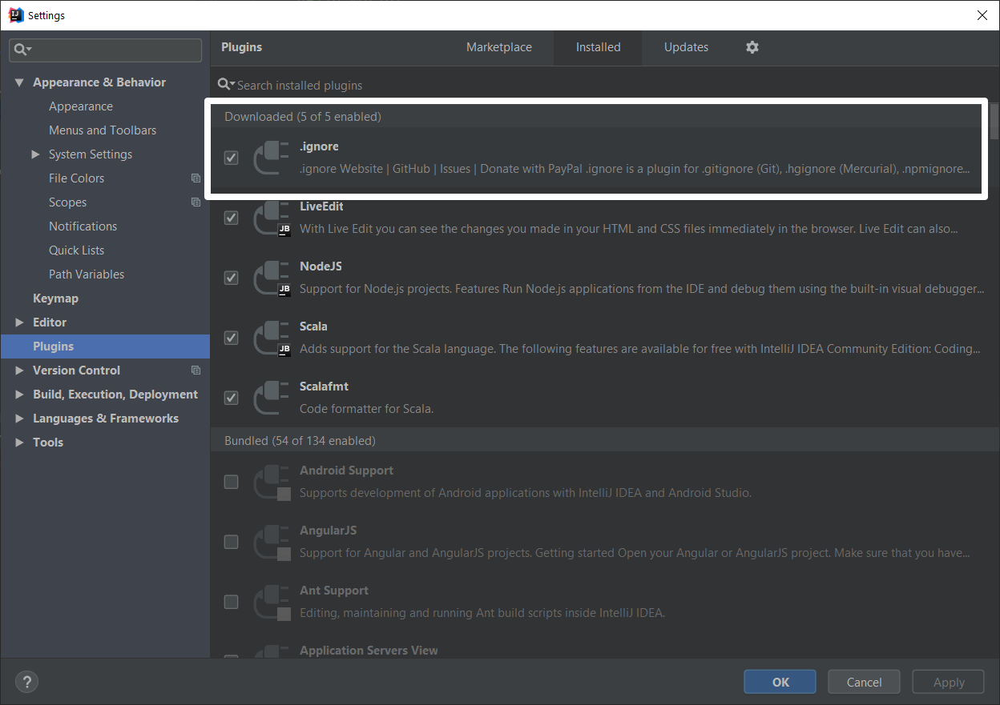
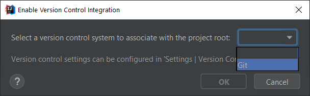
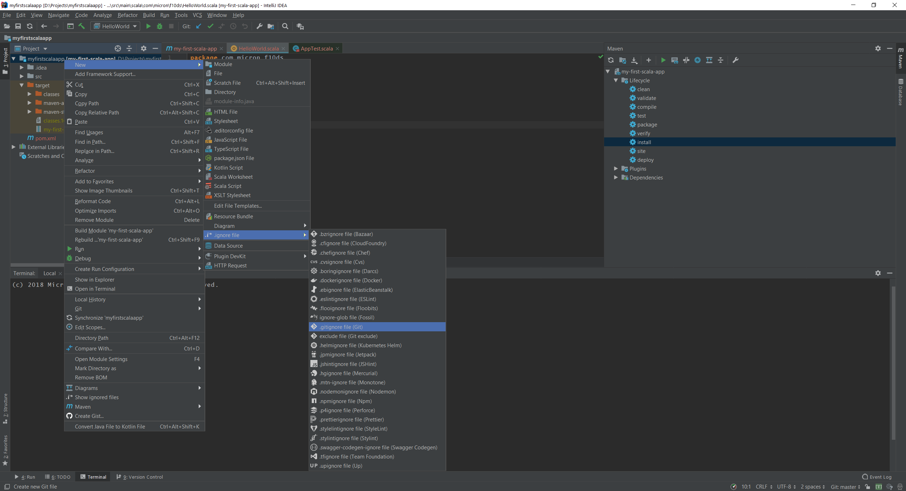

## IDEA Intellij Setup for Scala/Spark Application

Software preparation

1. Install IDEA Intellij from https://www.jetbrains.com/idea/download/ 

2. Install Java 1.8 SDK from https://www.oracle.com/technetwork/java/javase/downloads/jdk8-downloads-2133151.html

   - When installing Java JDK, try to avoid space in the folder name. for example, you can use c:\Java\SDK as installation folder.

> 

3. Install Maven from https://maven.apache.org/download.cgi. 
4. Install Scala 2.11.8 from https://downloads.lightbend.com/scala/2.11.8/scala-2.11.8.msi. 

---
Once all preparation is done, we will start to create project in IDEA Intellij. 

> 

1. Open Intellij and create a Maven project.
2. Choose Project SDK as Java 1.8.
3. Choose a archetype as project folder template. For example, scala-archetype-simple

> 

4. Name your GroupId and ArtifactId

> 

	- GroupId: group name, for example, com.micron.f10ds
	- ArtifactId: unique jar name, for example, my-first-scala-app

If you do this inside Micron environment, please update your maven `settings.xml` (for example, C:\Users\TAN PENG\.m2\settings.xml) to https://github.com/NUSTemple/training/blob/master/templates/settings.xml to replace the maven repo and add proxy.

If project is created successfully, you should see below folder structure. 
> 

- `.idea` folder is used by IDEA intellij only. it is not related to your project code
- `src` folder is used to store your functional code
- `test` folder is used to store your test code
- `pom.xml` is used for maven configuration. This file will use to download project dependency and also tell maven how to build your application. 

for simplicity, you can replace your `pom.xml` to this file https://github.com/NUSTemple/training/blob/master/templates/pom.xml. 

With this, you can start to code your first scala applications. 

### README.md

As a good habit, please always create a `README.md` file in your repo and indicate the purpose of this repo. This will help others to easily understand what this repo is about. For Github, it by default will display the content from `README.md`.

### Git and .gitignore file

As a good habit, please always enable the version control of your repo. 

1. Install .ignore plugin. This plugin is __super__ useful when integration with Git. It will ignore unnecessary files and avoid to track by Git. If you do not install it yet, please install via menu, `File --> Settings --> Plugins`

> 

2. Enable Version Control

   - Even Micron Bitbucket, please choose Git also. Bitbucket is backended by Git also. 

     > 

     > 

3. Configure `.gitignore` file 

   - Option 1: you can copy and paste below content into your `gitignore`

   ```reStructuredText
   # Created by .ignore support plugin (hsz.mobi)
   ### Example user template
   /target/
   # IntelliJ project files
   .idea
   *.iml
   out
   gen
   
   ### Scala template
   *.class
   *.log
   ```
   - Option 2: use .ignore plugin and auto generate this file. 

     create a new .ignore file and tick `Example user template` and `Scala` template. 

     

     > 

     >    

### Example Project Repo

You can clone <span style='color:blue'> [this repo](https://github.com/NUSTemple/myfirstscalaapp) </span> and find all example codes here. 

 