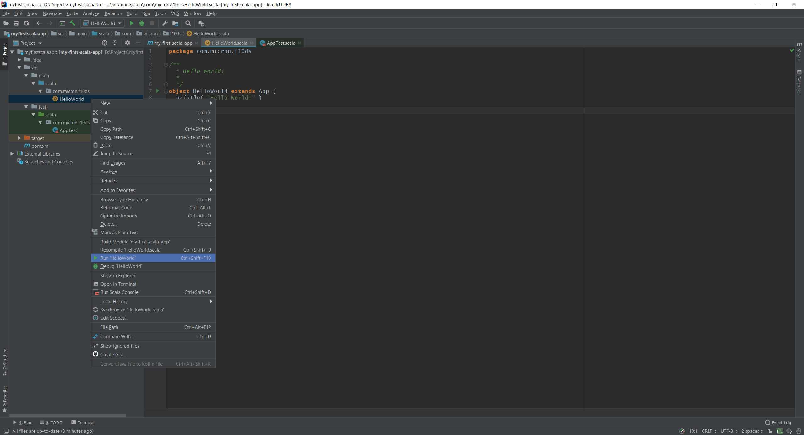
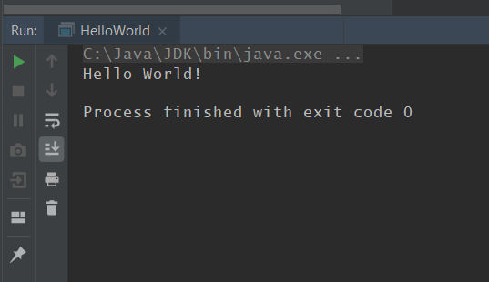
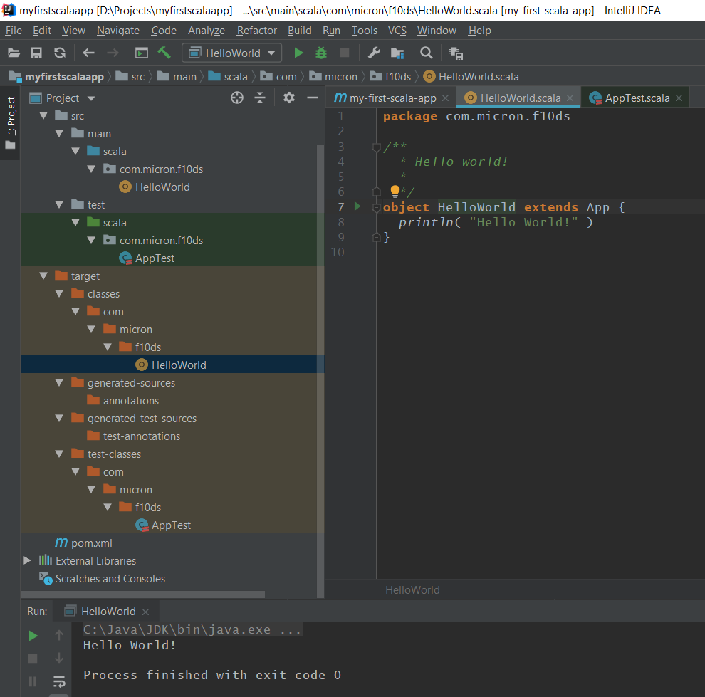
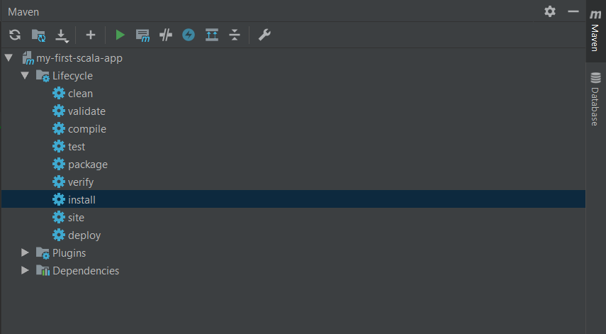
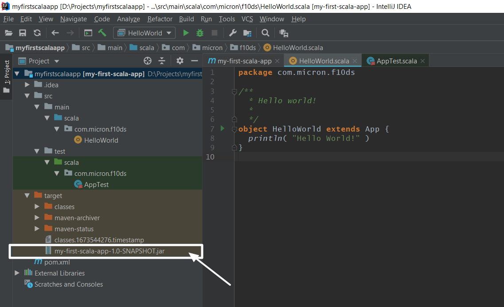
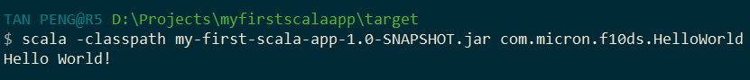

## Use Intellij to build a "Hello World" App


Please follow chapter 1 `01-Intellij Setup for Scala Application IDE` to setup your IDE if you have not done so. Furthermore, please create a maven project `HelloWorld` 

Let's create a `HelloWorld` project like below. This is to print out HelloWorld on the screen

```scala
package com.micron.f10ds

/**
 * Hello world!
 *
 */
object HelloWorld extends App {
  println( "Hello World!" )
}
```

 

After script is compiled, you will observe `HelloWorld` on the console. At same time, there is an extra folder `target` generated. 





> - The `target` directory is used to house all output of the build.
> - `classes` folder:  contains the compiled classes
> - `generated-sources` folder:
> - `generated-test-sources` folder: contains the compiled test classes
> - `test-classes` folder:

### Create a  jar for deployment usage

We will use Maven plugin in intellij to build the jar. This plugin should be available directly if you create a Maven project. Related plugin will be downloaded and jar (`my-first-scala-app-1.0-SNAPSHOT.jar`) will be built in `target` directory. 



```bash
C:\Java\JDK\bin\java.exe -Dmaven.multiModuleProjectDirectory=D:\Projects\myfirstscalaapp "-Dmaven.home=C:\Program Files\JetBrains\IntelliJ IDEA 2018.3.2\plugins\maven\lib\maven3" "-Dclassworlds.conf=C:\Program Files\JetBrains\IntelliJ IDEA 2018.3.2\plugins\maven\lib\maven3\bin\m2.conf" "-javaagent:C:\Program Files\JetBrains\IntelliJ IDEA 2018.3.2\lib\idea_rt.jar=2444:C:\Program Files\JetBrains\IntelliJ IDEA 2018.3.2\bin" -Dfile.encoding=UTF-8 -classpath "C:\Program Files\JetBrains\IntelliJ IDEA 2018.3.2\plugins\maven\lib\maven3\boot\plexus-classworlds-2.5.2.jar" org.codehaus.classworlds.Launcher -Didea.version=2018.3.2 install
[INFO] Scanning for projects...
[INFO]                                                                         
[INFO] ------------------------------------------------------------------------
[INFO] Building my-first-scala-app 1.0-SNAPSHOT
[INFO] ------------------------------------------------------------------------
Downloading: https://repository.apache.org/snapshots/commons-codec/commons-codec/maven-metadata.xml
Downloading: https://oss.sonatype.org/content/repositories/snapshots/commons-codec/commons-codec/maven-metadata.xml
Downloading: https://repo.maven.apache.org/maven2/commons-codec/commons-codec/maven-metadata.xml
Downloaded: https://repo.maven.apache.org/maven2/commons-codec/commons-codec/maven-metadata.xml (642 B at 0.5 KB/sec)
[INFO] 
[INFO] --- maven-resources-plugin:2.6:resources (default-resources) @ my-first-scala-app ---
[INFO] Using 'UTF-8' encoding to copy filtered resources.
[INFO] skip non existing resourceDirectory D:\Projects\myfirstscalaapp\src\main\resources
[INFO] 
[INFO] --- maven-compiler-plugin:3.1:compile (default-compile) @ my-first-scala-app ---
[INFO] Nothing to compile - all classes are up to date
[INFO] 
[INFO] --- scala-maven-plugin:3.3.2:compile (default) @ my-first-scala-app ---
[INFO] artifact commons-codec:commons-codec: checking for updates from central
[INFO] D:\Projects\myfirstscalaapp\src\main\scala:-1: info: compiling
[INFO] Compiling 1 source files to D:\Projects\myfirstscalaapp\target\classes at 1547129199177
Downloading: https://repo.maven.apache.org/maven2/org/scala-lang/modules/scala-xml_2.11/1.0.4/scala-xml_2.11-1.0.4.pom
Downloaded: https://repo.maven.apache.org/maven2/org/scala-lang/modules/scala-xml_2.11/1.0.4/scala-xml_2.11-1.0.4.pom (3 KB at 6.3 KB/sec)
Downloading: https://repo.maven.apache.org/maven2/org/scala-lang/scala-library/2.11.4/scala-library-2.11.4.pom
Downloaded: https://repo.maven.apache.org/maven2/org/scala-lang/scala-library/2.11.4/scala-library-2.11.4.pom (2 KB at 2.1 KB/sec)
Downloading: https://repo.maven.apache.org/maven2/jline/jline/2.12.1/jline-2.12.1.pom
Downloaded: https://repo.maven.apache.org/maven2/jline/jline/2.12.1/jline-2.12.1.pom (17 KB at 27.6 KB/sec)
Downloading: https://repo.maven.apache.org/maven2/org/scala-lang/modules/scala-xml_2.11/1.0.4/scala-xml_2.11-1.0.4.jar
Downloaded: https://repo.maven.apache.org/maven2/org/scala-lang/modules/scala-xml_2.11/1.0.4/scala-xml_2.11-1.0.4.jar (633 KB at 56.2 KB/sec)
Downloading: https://repo.maven.apache.org/maven2/org/scala-lang/scala-library/2.11.4/scala-library-2.11.4.jar
Downloaded: https://repo.maven.apache.org/maven2/org/scala-lang/scala-library/2.11.4/scala-library-2.11.4.jar (5408 KB at 64.3 KB/sec)
[INFO] prepare-compile in 0 s
[INFO] compile in 99 s
[INFO] 
[INFO] --- maven-resources-plugin:2.6:testResources (default-testResources) @ my-first-scala-app ---
[INFO] Using 'UTF-8' encoding to copy filtered resources.
[INFO] skip non existing resourceDirectory D:\Projects\myfirstscalaapp\src\test\resources
[INFO] 
[INFO] --- maven-compiler-plugin:3.1:testCompile (default-testCompile) @ my-first-scala-app ---
[INFO] Nothing to compile - all classes are up to date
[INFO] 
[INFO] --- maven-surefire-plugin:2.12.4:test (default-test) @ my-first-scala-app ---
[INFO] No tests to run.
[INFO] 
[INFO] --- maven-jar-plugin:2.4:jar (default-jar) @ my-first-scala-app ---
[INFO] Building jar: D:\Projects\myfirstscalaapp\target\my-first-scala-app-1.0-SNAPSHOT.jar
[INFO] 
[INFO] --- maven-install-plugin:2.4:install (default-install) @ my-first-scala-app ---
[INFO] Installing D:\Projects\myfirstscalaapp\target\my-first-scala-app-1.0-SNAPSHOT.jar to C:\Users\TAN PENG\.m2\repository\com\micron\f10ds\my-first-scala-app\1.0-SNAPSHOT\my-first-scala-app-1.0-SNAPSHOT.jar
[INFO] Installing D:\Projects\myfirstscalaapp\pom.xml to C:\Users\TAN PENG\.m2\repository\com\micron\f10ds\my-first-scala-app\1.0-SNAPSHOT\my-first-scala-app-1.0-SNAPSHOT.pom
[INFO] ------------------------------------------------------------------------
[INFO] BUILD SUCCESS
[INFO] ------------------------------------------------------------------------
[INFO] Total time: 02:00 min
[INFO] Finished at: 2019-01-10T22:08:19+08:00
[INFO] Final Memory: 29M/547M
[INFO] ------------------------------------------------------------------------

Process finished with exit code 0
```



### Run this jar

syntax is scala -classpath `your jar file path` `your_group_id.classname`


```bash
scala -classpath my-first-scala-app-1.0-SNAPSHOT.jar com.micron.f10ds.HelloWorld
```


