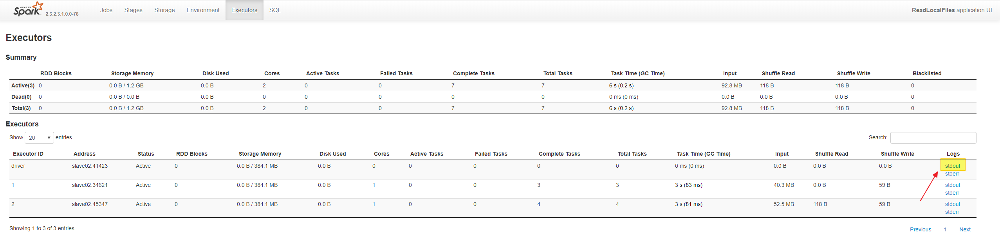
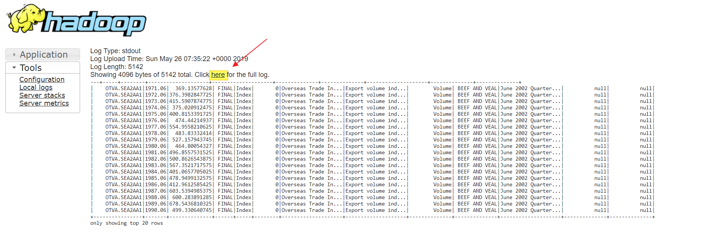
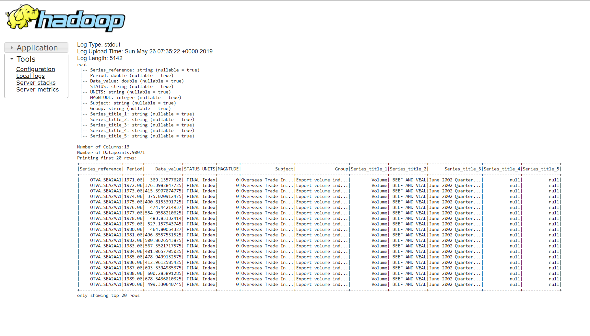

## Use Spark to read HDFS file data

```scala
package com.micron.f10ds
import org.apache.spark.sql.{DataFrame, SparkSession}
import org.apache.spark.internal.Logging
import org.apache.log4j.{Level, LogManager, PropertyConfigurator}
/**
  * Hello world!
  *
  */
object HelloWorld extends App with Logging {
  val spark = SparkSession.builder().appName("ReadLocalFiles")
    .master("yarn").getOrCreate()
  val sc = spark.sparkContext
  sc.setLogLevel("WARN")
  val df: DataFrame = spark.read.option("header", "true").option("inferSchema", "true")
    .format("csv").load("/user/pengtan/sample_data/o*.csv")
  logWarning( "Hello World!" )
  logWarning("Printing the schema of the data:")
  logWarning(df.printSchema().toString)
  println("Number of Columns:"+df.columns.toSeq.size)
  println("Number of Datapoints:"+df.count())
  println("Printing first 20 rows:")
  df.show()
｝

```

Command to run:

```bash

spark-submit --master yarn --deploy-mode client  \
--conf spark.eventLog.enabled=false \
--class com.micron.f10ds.HelloWorld \
my-first-scala-app-1.0-SNAPSHOT.jar
```
- `--deploy-mode` can be `client` or `cluster`. `client` mode will show 
log in console directly but `cluster` mode will show in the WebUI. Log 
for `cluster` mode can be view in Web UI as shown below

> 

> 

> 